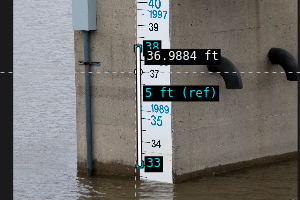
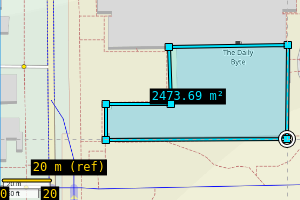
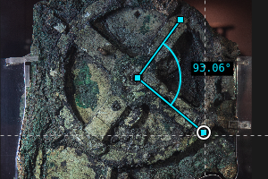

# pickleruler

Measure anything on your screen

<a href="https://evidlo.github.io/pickleruler">Live app here!</a>

  
   
  

## Python Version

    # x11 only currently (why are you using wayland?)
    uv tool install git+https://github.com/evidlo/pickleruler
    pickleruler